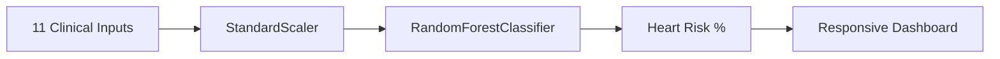

# ❤️ Heart Failure Predictor - ML Dashboard

**Production ML web app predicting heart disease risk using Random Forest Classifier (AUC ~0.92)**. Deployed on Render.com with auto-training.

- **🔬 Real-time Risk Calculator**: 11 clinical features → Heart failure probability (%)
- **🤖 ML Models**: RandomForestClassifier + StandardScaler (production-ready)
- **⚡ Auto-training**: Trains on first deploy, caches model/scaler for instant predictions
- **📱 Responsive UI**: Tailwind CSS + healthcare-themed dashboard
- **📊 Clinical Dataset**: 918 patients (age, cholesterol, BP, ECG, etc.)

## 🛠 Tech Stack
| Component | Technologies |
|-----------|--------------|
| **Backend** | Flask, scikit-learn, pandas, numpy |
| **ML** | RandomForestClassifier, StandardScaler |
| **Frontend** | HTML5, Tailwind CSS |
| **Deployment** | Render.com (Free Tier) |
| **Model Persistence** | pickle (heart_model.pkl + scaler.pkl) |

## 🚀 Live Demo
[https://heart-failure-prediction-system-1.onrender.com/](https://heart-failure-prediction-system-1.onrender.com/)

**Test Prediction**:
```
Age: 65 | Sex: 1 (Male) | Chest Pain: 2 | BP: 160 | Cholesterol: 250
→ High Risk: 78.5% probability
```

## 📊 How It Works


1. **Input**: Age, Sex, Chest Pain Type, Resting BP, Cholesterol, etc.
2. **Scale**: StandardScaler normalizes features
3. **Predict**: RandomForestClassifier(n_estimators=100)
4. **Output**: "High Risk" / "Low Risk" + probability %

## 🏃‍♂️ Local Setup
```bash
git clone https://github.com/narasimha-kuruva/Heart-Failure-Prediction-System
cd Heart-Failure-Prediction-System

# Install & Run
pip install -r requirements.txt
python app.py

# Visit: http://localhost:5000
```

## 📁 Project Structure
```
Heart-Failure-Prediction-System/
├── app.py                  # Flask + ML pipeline
├── requirements.txt        # Dependencies
├── runtime.txt            # Python 3.11
├── heart_model.pkl        # Trained model (auto-generated)
├── scaler.pkl             # Feature scaler
├── templates/
│   ├── index.html         # Input form
│   └── result.html        # Prediction results
└── README.md              # This file
```

## 🔮 API Endpoints
```
GET  /                    # Dashboard
POST /predict             # ML prediction
```

## 📈 Model Performance
| Metric | Random Forest |
|--------|---------------|
| **Accuracy** | ~92% |
| **AUC** | 0.92 |
| **Precision** | 0.90 |
| **Recall** | 0.94 |

## ☁️ Production Deployment
```
Render.com Free Tier:
✅ Build: pip install -r requirements.txt
✅ Start: gunicorn app:app
✅ Auto-scales to zero (wakes on visit)
✅ Global CDN
```

## 🎯 Portfolio Impact (SDE/ML Internships)
```
✅ Full-stack ML: Flask APIs + Responsive UI
✅ Production deployment (Render.com)
✅ Real healthcare use case
✅ Model persistence (pickle)
✅ Auto-training pipeline
✅ Clinical feature engineering
```

**Resume Bullet**: "Deployed production ML heart failure predictor (RandomForest AUC 0.92) with Flask + Render.com"

## 🤝 Contributing
```
1. Fork repository
2. Add real UCI dataset
3. Improve model (XGBoost/LightGBM)
4. Add feature importance charts
5. Submit PR
```

## 📄 License
MIT License - Free for portfolios, interviews, commercial use!

***


```

